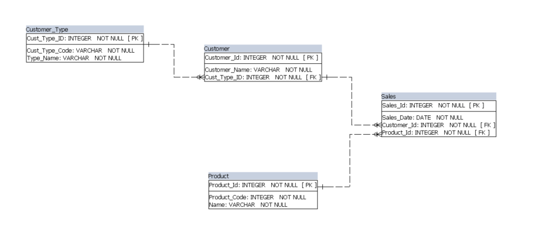
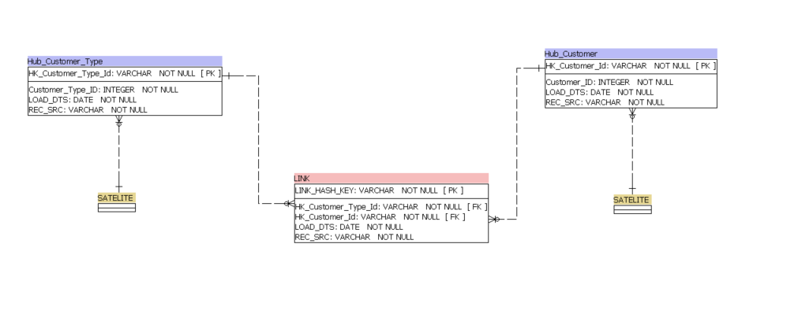
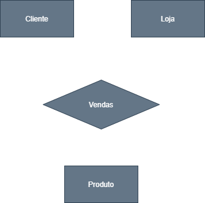

# Detalhamento de Links

## Links representam os relacionamentos entres chaves unicas de negócio no modelo DV2.0, e não incluem dados descritivos. Seu formato é bem parecido com o de uma `Factless-Fact` (Um dos tipos de fato propostas por Ralph Kimball).

### Relacionamentos e associações:
- Link padrão ou Standard Link (Foreign Key e Primary Key)

| LINK              | 
|-------------------|
| LINK_HASH_KEY PK  | 
| HK_HUB1       FK  | 
| HK_HUB2       FK  | 
| LOAD_DTS          | 
| REC_SRC           |

> Caracteristicas: relacionamentos unicos, não incluem dados descritivos, relacionamentos com o passado, presente e futuro, Links não contém campos de `start_dt` e `end_dt` como em dimensões SCD II. E os principais campos contidos em uma link table são colunas chaves com hash originadas em tabelas relavantes para o modelo, a origem do registro e um campo de data que guarda a primeira vez esse relacionamento foi feito no DV, e finalmente a `Hash Key Column`, que é um identificador unico da tabela gerado por um calculo baseado nas BK originadas em outras tabelas.

### Hierarquias e redefinições
- Relacionamentos hierarquicos são modelados por HAL (Hierarchical Link)
- Redefinições são modelados por SAL (same-as Link)

### Transações e eventos
- Links não historicos (possuem diferentes modelagens para Hubs e Links)
- Pedidos de venda ou dados de sensor

# Veja o exemplo abaixo

_Imagine o cenário acima como uma loja de eletronicos vendendo um celular ou um tablet, e para realizar esta venda e armazenar informações relevantes sobre este evento, sistematicamente nós tempos um conjunto de tabelas que usam a 3ª forma normal em um banco de dados._

### __Observe que este modelo foi modelado de forma tradicional utilizando `3NF`. Vamos detalhar as informações presentes neste modelo:__

1. Olhando para tabela de vendas, podemos ver que ela cumpre a função de ter um relacionamento muitos para muitos (N..N) entre a tabela de clientes e a tabela de produtos, agindo como uma tabela ponte e também inclui dados da transação.

2. Olhando para o relacionamento entre a tabela de clientes e a tabela de tipos de clientes, podemos ver que existe uma relação hierarquica no sentido da tabela de tipos ser uma tabela `PAI` e a tabela de clientes é por sua vez a tabela `FILHA`, que significa que um unico tipo de cliente podem haver multiplos clientes. 

No caso 2, claramente quando pensamos na modelagem DV, nós precisamos de uma `Standard Link` entre estas duas entidades:

_____

# Detalhamento de transações
### __Agora que analisamos parcialmente um modelo e entendemos o papel de alguns relacionamentos e como são tratados ao pensar na modelagem DV, vamos à alguns detalhes:__

__Estudo de caso:__

Existe uma sorveteria em uma rua qualquer e nós queremos ir até lá comprar sorvete de ninho trufado. 
> Esta simples ação cria entidades em um banco de dados desta empresa de sorvetes, nós temos `Clientes`, `Loja` e `Produto`, onde a interação destas 3 cria uma transação de vendas.

De acordo com uma das regras de modelagem DV nós temos que modelar transações como ``Links``, e para faze-lo, criaremos 3 ``hubs`` para as entidades mencionadas anteriormente e uma `Link table` para o evento de vendas, incluindo todas as colunas chave que são relevantes para os ``hubs`` e as outras colunas obrigatórias.

Lembrando que podemos conectar `Satelites` em `Hubs` ou `Links`, porém neste cenario, estamos olhando os detalhes da transação, por tanto nossa tabela `Satelite` está conectada na transação ou `Transaction Link`.